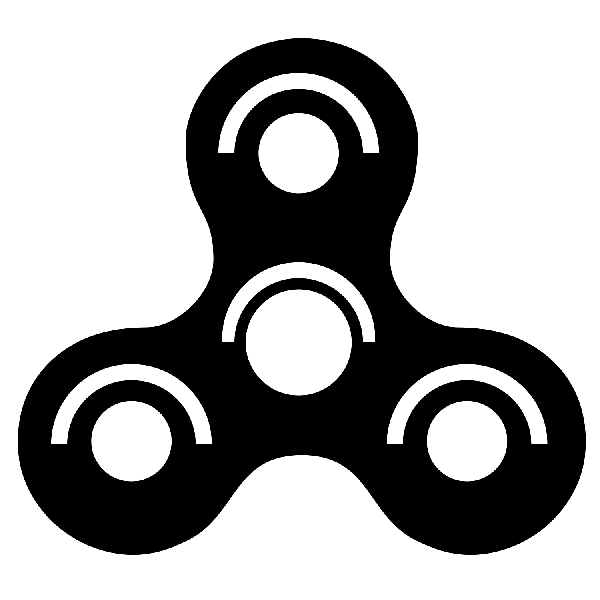

# The Fidget List

 <!-- Replace with your actual logo if available -->

## Table of Contents

- [Introduction](#introduction)
- [Features](#features)
- [Live Demo](#live-demo)
- [Installation](#installation)
- [Usage](#usage)
- [Contributing](#contributing)
- [Technologies Used](#technologies-used)
- [License](#license)
- [Contact](#contact)

## Introduction

**The Fidget List** is a comprehensive directory of Facebook fidget groups, designed to help individuals find and connect with communities that share their interests in various fidget toys and techniques. Whether you're a spinner enthusiast, a slider innovator, or interested in 3D printed fidgets, The Fidget List categorizes groups to suit your preferences.

## Features

- **Categorized Directory:** Easily browse Facebook groups based on categories like Sliders, Spinners, Beads, Metal, 3D Printed, and more.
- **Search and Filter:** Quickly find groups that match your specific interests using dynamic filtering options.
- **Responsive Design:** Accessible on all devices, ensuring a seamless experience whether you're on desktop or mobile.
- **Direct Links:** Access groups directly through provided links to join and engage with the community.
- **Visuals:** Each group listing includes an image for a visual representation of the community.

## Live Demo

Check out the live site: [https://thefidgetlist.com/](https://thefidgetlist.com/) <!-- Replace with your actual GitHub Pages URL -->

## Installation

To run **The Fidget List** locally, follow these steps:

1. **Clone the Repository:**

    ```bash
    git clone https://github.com/yourusername/the-fidget-list.git
    ```

2. **Navigate to the Project Directory:**

    ```bash
    cd the-fidget-list
    ```

3. **Serve the Project Locally:**

    Using Python 3:

    ```bash
    python3 -m http.server 8000
    ```

    Or using Node.js with `http-server`:

    ```bash
    npx http-server
    ```

4. **Access in Browser:**

    Open your web browser and navigate to `http://localhost:8000` to view the site.

## Usage

1. **Browse Groups:**

    - View the list of Facebook fidget groups in the directory.
    - Each group entry includes an image, name, description, link, and categories.

2. **Filter Groups:**

    - Use the checkboxes at the top to filter groups based on categories such as Sliders, Spinners, Beads, Metal, and 3D Printed.
    - Click "Reset Filters" to clear all selections and view all groups.

3. **Join Groups:**

    - Click on "Visit Group" to open the Facebook group in a new tab and join the community.

## Contributing

Contributions are welcome! Please read the [CONTRIBUTING.md](CONTRIBUTING.md) file for guidelines on how to get involved.

## Technologies Used

- **HTML5 & CSS3:** Structuring and styling the website.
- **JavaScript (ES6):** Handling data fetching, filtering, and dynamic content.
- **Bootstrap 5:** Responsive design and styling components.
- **GitHub Pages:** Hosting the live site.
- **JSON:** Managing group data.

## License

This project is licensed under the [MIT License](LICENSE).
## Contact

- **Project Link:** [https://github.com/thinkjk/the-fidget-list](https://github.com/thinkjk/the-fidget-list) 
